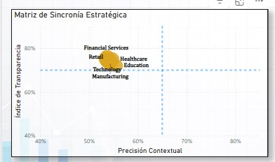

# 🤖 Executive AI Performance & Governance: End-to-End BI Solution

## 📌 Descripción del Proyecto
En la era de la automatización masiva, el reto no es desplegar IA, sino **gobernar su rendimiento**. Este proyecto es una solución integral de **Business Intelligence** diseñada para monitorear una infraestructura de **5,500 agentes de IA** en 11 sectores globales. La solución permite cruzar la eficiencia técnica (latencia) con el impacto real en productividad y el cumplimiento ético de privacidad, transformando logs técnicos en decisiones de inversión y riesgos.

---

## 📖 Storytelling: La Narrativa de los Datos
La IA no es rentable si no es ágil; y no es escalable si no es confiable.

1.  **El Problema:** La organización carecía de visibilidad sobre el "rendimiento invisible". Existían agentes con alta capacidad de respuesta pero nulo impacto operativo, y otros con alta precisión pero una latencia que provocaba el abandono del usuario.
2.  **El Enfoque:** Implementé una arquitectura de **Matrices de Sincronía y Agilidad**. En lugar de ver promedios aislados, creamos cuadrantes de desempeño que clasifican a los agentes en **Élites, Potenciales o Críticos**, permitiendo una limpieza selectiva de la infraestructura.
3.  **La Conclusión:** Revelamos que la productividad no es lineal. Existe un **"Techo del Éxito Operativo"** en el 75% donde más volumen no garantiza mejores resultados; la clave reside en la personalización del contexto por industria.

---

## 📐 Arquitectura Técnica

1.  **Data Foundation:** Procesamiento de más de 5,000 registros mediante **MySQL**, aplicando normalización y limpieza para asegurar que cada métrica de "Score de Confianza" e "Impacto" sea comparable entre sectores.
2.  **Modeling:** Diseño de un **Esquema en Estrella (Star Schema)** que vincula los hechos de performance con dimensiones críticas: Industria, Caso de Uso, Complejidad y Nivel de Autonomía.
3.  **Analytics Layer:** Desarrollo de **Vistas SQL** y lógica **DAX Avanzada** para calcular dinámicamente el "Impacto Productividad" y segmentar visualmente los cuadrantes mediante formateo condicional basado en umbrales de negocio.

---

## 📊 Dashboard & Insights Clave

### 1. La Barrera de los 9 Segundos
Identificamos que la mejora de productividad del **12.75%** está estrechamente ligada a latencias inferiores a **9 segundos**. Cualquier agente que supere este umbral entra en la **'Zona de Deserción'**, donde el tiempo de espera anula completamente la eficiencia ganada por la automatización.

---

### 2. El Paradigma de la Explicabilidad (Scatter Analysis)
Sectores como **Education** demuestran que una alta explicabilidad (72%) no compensa una baja precisión contextual (55%). Este "gap" identifica una zona de riesgo donde el agente justifica errores con seguridad, induciendo una **falsa sensación de seguridad** en el usuario final.

---

## 🚀 Impacto y Valor de Negocio
* **Optimización de Recursos:** Identificación inmediata de agentes "Críticos" para re-entrenamiento, ahorrando costos de procesamiento en modelos ineficientes.
* **Gobernanza Ética:** Monitor de cumplimiento en **Privacidad de Datos**, asegurando que el despliegue tecnológico no comprometa la integridad legal de la empresa.
* **Escalabilidad Estratégica:** El modelo permite identificar agentes "Élite" con alto impacto y baja latencia, listos para ser replicados en otras unidades de negocio.

---

## 👤 Sobre mí
Soy **Marccell Alejandro Vilchez Calero**, profesional en Contabilidad Pública y Finanzas con especialización en **Data Analysis & Business Intelligence**. Mi enfoque combina el rigor contable con la agilidad del desarrollo de software.

Mi metodología se basa en:
* **Asertividad Analítica:** No pregunto qué datos hay; propongo qué respuestas necesitamos encontrar para marcar territorio en el mercado y liderar con seguridad.
* **Diseño de Autoridad:** Dashboards orientados a la acción, donde el silencio y el espacio visual dirigen la mirada hacia lo que realmente importa: la rentabilidad.
* **Eficiencia Técnica:** Dominio del stack SQL, Power BI y Python para construir soluciones que no solo reportan el pasado, sino que dictan el futuro.

---

## 💼 Servicios & Colaboración
* **End-to-End Analytics:** Desde la limpieza en MySQL hasta el storytelling ejecutivo en Power BI.
* **Business Intelligence:** Auditoría de modelos de datos, optimización de DAX y diseño de matrices de decisión.
* **Consultoría de Productividad:** Análisis de cuellos de botella operativos mediante datos.

---
_Proyecto finalizado en 2026 como parte de mi portafolio profesional de Business Intelligence._
